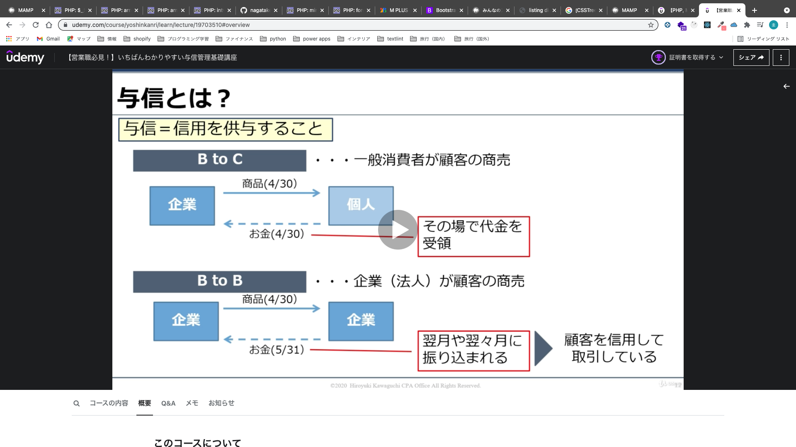
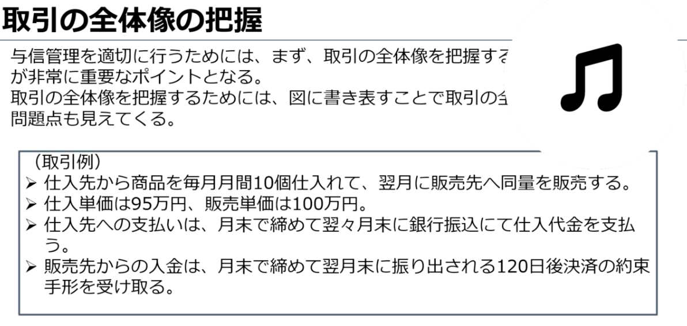

# 与信管理基礎講座
- 目的
  - 実務で活かせる与信管理の基礎知識・スキルを身につける

-  対象者
   - 会計スキルをあげたい営業担当者
   - 与信管理って何？と興味はある方
   - 危険な会社の見分け方を知りたい方
   - ERPと組み合わせて取引先の実態を多面的に見る目を養いたい方
   - 与信管理に有効な財務分析指標を身につけたい方

- 全体像
  - 与信管理の基礎
  - 企業分析
  - 定性情報分析
  - 定量情報分析
  - 信用不安への備えと対応策
  - 企業情報の収集方法

## 与信管理の基礎
### 与信とは
  - 与信＝信用を供与すること
    - 辞書
  - B to C(一般消費者が顧客の商売)
    - 基本的にその場代金を受領できる
    - 商品（8/31）
    - お金（8/31）
  - B to B(企業（法人）が顧客の商売)
    - 基本的に取引後のどこかのタイミングで振り込まれる
    - 商品（8/31）
    - お金（9/30）
    - 後で振り込んでくれるということを信頼して取引している



### なぜ信用取引を行うのか？
  - 企業間取引（B to B）は反復連続的に行われる
  - 取引の都度、現金の受け渡しをするのは煩雑
  - 翌月や翌々月などにまとめて後払い
  - この期間は代金が回収されないリスク（信用リスク）に晒される
  - 新規顧客の選定や既存顧客の把握（与信管理）は企業間取引を行う上で非常に重要となる

### 与信管理の重要性
  - A. 1億円/10% = 10億円
  

### 取引の全体像の把握
  - 与信管理を適切に行うためには、まず、取引の全体像を把握する。特に「決済条件」が非常に重要なポイントとなる
  - タイムライン型取引フロー図で金とモノの動きを考える
  - 回収までの期間が長い＝信用リスクに晒される期間が長い

  
  

### 与信金額と与信限度額
  - 与信金額は、取引条件を元に以下の計算式を使って算出する

```
<与信金額の計算式>

月間販売数量販売数量×単価×回収期間（月）
```

#### 与信金額を抑えるためには、
  - 取引金額を小さくする
  - 回収サイトを短くする
  - 担保をとる
  - 営業保証金をとる

### 手形とは
  - 手形は、所定の紙面に記載された金額の支払請求権が証券化されたもの。
  - 約束手形の他為替手形があるが、通常は約束手形が用いられる
  - 約束手形の決済は満期日（支払期日）に行われる。
    - 例えば、販売先から満期が振出日の３ヶ月後の約束手形を受け取ったら、販売先に３ヶ月間の信用を供与したことになる


### 手形の仕組み
  - 注意
    - 振出人の当座預金の残高不足等で手形が決済できないことを「手形の不渡り」という。
    - 6カ月間に2回不渡を出すと、振出人は「銀行取引停止処分」を受け、事実上倒産となる。


## 企業分析
  - 与信先（販売先）が信用力が高いかどうかを見分けるため、企業分析を行う
  - 信用力がない（支払い能力が低い）会社
    - 与信金額を小さくして、厳格な管理を行う
  - 信用力がある（支払い能力が高い）会社
    - 与信金額を大きくして、管理を簡略化する

### 企業分析の種類
  - 与信管理において企業分析をする際には、定性分析と定量分析、両面から総合的に分析する必要がある。
  - 定性分析
    - 数値では測定できない
  - 定量分析
    - 数値で測定できる

### 格付け
  - 定量情報と定性情報をもとに、信用力の高さに応じて販売先の格付けを行う。


### 定性情報分析（沿革）
  - 会社設立の経緯、経営理念、歴史の長さ、経営体制の変遷、業容拡大のスピードなどを把握・理解することで、会社の基本的属性をつかむ
    - ホームページやパンフレット等から情報を収集
    - 経営陣・従業員へのインタビュー
    - 同業他社や取引先からのヒアリング

### 定性情報分析（経営者）
  - 会社の衰退は経営者の資質に大きく依存する。
  - 特に、中小企業は経営者やその一族が株式の全てを有している「オーナー経営」がほとんどであるため、経営者の力量が占めるウェイトは大きい
    - 経営者自身の経歴（学歴、職歴、経済力等）、事実関係を調査・把握

### 定性情報分析（株主）
  - 大株主が優良企業の場合
    - 親会社から追加出資や追加借入れにより、資金面を手当してくれることが期待できるため、信用力は相応にあると考えられる
    - ただし、大株主が業績不振に陥ったら、事業整理の一環で、グループから外されることも念頭に置いていおく必要がある

  - 大株主が経営者自身の資金力の有無により信用力が左右される

### 定性情報分析（幹部社員・従業員）
  - 経営者の暴走に対してブレーキ役となる役員等がいるかどうか？
  - 社長の代替人材が社内にいるかどうか？
  - エース級の人材の退職は、会社の運営・業績に直接影響することもある。
  - 従業員の様子や社内の雰囲気の変化にも注意する

### 定性情報分析（取引銀行）
  - 安定的な資金調達ができるよう、銀行との良好な関係が構築できているか？
  - 突然のメインバンクの変更があったら注意
    - メインバンクは会社の情報を豊富に握っているため、業績悪化により、貸し剥がしや貸出金利の引き上げなどの行動に出た可能性がある
  - 無借金経営は場合によってはリスクになる
    - 新規の融資には時間がかかる

### 定性情報分析（販売先）
  - 優良な販売先があり、安定して販売できるルートを持っているか？
  - 業績不振の販売先が多いと、売掛金の回収不能による資金繰り悪化のリスクを考慮に入れる
  - 優良な販売先を持っていても、販売先１社に対する売り上げが会社全体の売上のほとんどを占めている場合は注意が必要

### 定性情報分析（仕入先）
  - 信頼できる仕入先からの調達はスムーズに行われているか？
  - 主力仕入先は信用力があるか？
  - 主力仕入先が異常を察知して取引縮小や決済条件を短縮した場合には、会社経営になんらかの問題が生じた可能性がある。

### 定性情報分析（業界・商品）
  - 会社が属する業界全体の動向や業界内における地位（位置付け）
  - 業界または取扱商品・製品の市場規模、業界全体の好不調・将来性、需給状況、同業他社との競合状況など
  - 会社が製造あるいは販売している商品のライフサイクル
    - 技術革新や消費動向の変化が目まぐるしい商品を取り扱っている場合は、過剰在庫を抱えて資金繰りが悪化するリスクが大きい

### 定性情報分析（危険情報）
  - 割止め
    - 金融機関などが手形の割引を拒否すること
  - 手形ジャンプ
    - 手形振出人が、手形の支払期日に、支払期日が先の手形で決済すること
  - リスケ
    - 金融機関などに借入金の返済期日の延長を求めること
  - 支払遅延
    - 決済日に入金がない

## 定量情報分析
### 定量情報分析（自己資本比率）
  - 資産に対して自己資本（≒純資産）がどのくらいの割合かを示す指標
    - 高ければ高いほど安全性が高い
  - 自己資本比率（％）= 自己資本（≒純資産）/資産


### 定量情報分析（自己資本比率の留意点）
  - 純資産は、株主から出資してもらった分と自社で稼いだ分に大別される。
  - 同じ自己資本比率でも、純資産の内訳によってその会社の安全性が異なる
    - 資本金や資本剰余金が大きい会社
      - 資金調達をうまくやっている会社
    - 利益剰余金が大きい会社
      - 過去にたっぷり稼いだ会社


### 定量情報分析（流動比率）
  - 流動負債に対して流動資産がどのくらいの割合かを示す指標
    - 高ければ高いほど短期的な支払能力が高い
  - 流動比率（％）= 流動資産/流動負債


### 定量情報分析（総資産回転率）
  - 資産に対してどれだけの売上をあげたのかを表す指標
    - 高ければ高いほど効率的に売上を獲得している
  - 総資産回転率（回）= 売上高/資産
  - 総資産回転率があまりに低い会社は、不良債権を抱えている可能性あり


### 定量情報分析問題


### 定量情報分析回答
  - 黒字倒産したアーバンコーポレーション


### 定量情報分析（回転期間分析）
  - 在庫回転期間
    - 商品を仕入れてから販売するまでの平均期間
    - 在庫回転期間（日）= 棚卸資産/(売上原価/365)
    - ※棚卸資産回転期間ともいう
    - ※棚卸資産（商品、製品、仕掛品、原材料など）
  - 売上債権回転期間
    - 販売してから代金を回収するまでの平均期間
    - 売上債権回転期間（日）= 売上債権/（売上高/365日）
    - ※売上債権（受取手形、売掛金など）

### 定量情報分析（在庫回転期間）


### 在庫回転期間のチェックポイント
  - 同業他社と比べて極端に長くなっていないか？
  - 経年で推移を見て徐々に長くなっていないか？
    - 過剰に在庫を保有しすぎている（無茶な拡大路線）
    - 売れる見込みのない商品をいつまでも抱えている
    - 粉飾決算（不正会計）
      - 信用リスクが高い会社

### 定量情報分析（売上債権回転期間）


### 売上債権回転期間のチェックポイント
  - 業界標準の回収サイトと比べて極端に長くなっていないか？
  - 経年で推移を見て徐々に長くなっていないか？
    - 顧客企業と不利な契約（資金繰りが悪い）
    - 回収見込みのない売掛金がある
    - 粉飾決算（不正会計）
      - 信用リスクが高い会社

## 信用不安への備えと対応策
### 債権保全
  - 顧客企業に対する売上債権が確実に回収できるようにするため、平常時から行う種々の方策のこと

#### 債権保全の種類
  - 契約条項の厳格化
    - 「期限の利益喪失」条項や「所有権留保」条項を契約書に盛り込んでおけば、販売先が倒産危機に陥った場合、支払期日前であっても即座に支払を行うよう求めることができ、代金決済前の商品を引き上げることができる
  - 廻り手形での決済
    - 販売先の信用不安がある場合、販売先が振り出す手形の代わりに、販売先が保有する信用力のある手形を受け取ることで、回収を確実にする
  - 相殺
    - 販売先に対する債権があり、かつ、販売先から債務を負っている場合、一方的意思表示で差引き決済できる
  - 担保・保証金
    - 信用不安がある販売先と取引する際に、その会社の保有する資産を担保に取る、あるいは保証金を提供してもらうことで、万が一に備える
  - 格付による与信管理
    - 相手の信用力に応じて、あらかじめ与信限度額を定め、限度額内での取引金額に留めることで、影響額を限定する

### 緊急時の債権フロー
  - 実際の販売先が倒産危機に陥った場合、早期に債権の回収に動く必要がある
  - ①顧客企業が倒産危機？
  - ②即座に商品の出荷をストップ
  - ③顧客企業の現状把握
    - 営業継続中か停止中か
    - 経営者の所在は明らか
    - 経営破綻の法的手続きの有無
  - ④契約内容の確認
    - 期限の利益喪失条項
    - 所有権留保条項
  - ⑤早期の弁済の要求、債権譲渡契約により売掛金の譲渡（ファクタリング会社）、保有手形の裏書き譲渡、自社商品の引き揚げ、担保権の実行などを言う
    - 具体的には、電話をかける、請求書を再発行する、客先に出向く、請求書を持参して面談して支払交渉をする、配達証明付内容証明郵便で督促書を送付するという行動が必要


