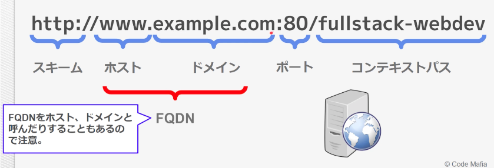
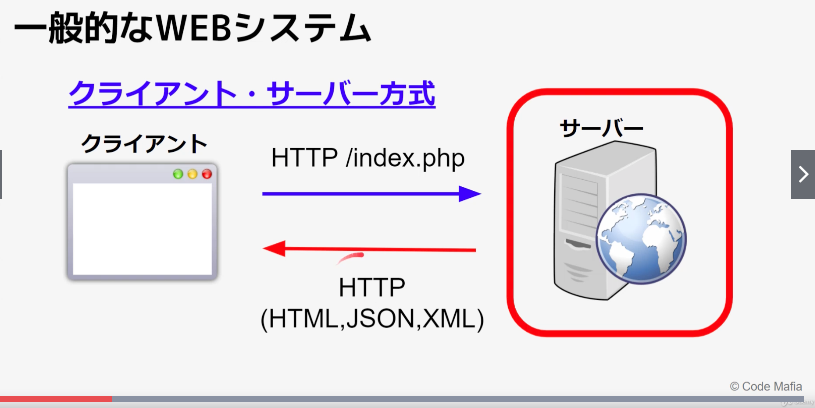

# Webの基礎知識

## IPアドレス
  - インターネット上で通信する端末が必ず持つ住所
  - 32bitで表される
  - 例）192.168.0.2

### 種類
  - グローバルIP
  - プライベートIP
  - 範囲：0.0.0.0 ~ 255.255.255.255

#### プライベートIP
  - LANなどの拠点内ネットワークに存在する端末が自由に使用できるIPアドレス
  - 範囲
    - 10.0.0.0 ~ 10.255.255.255
    - 172.16.0.0 ~ 172.31.255.255
    - 192.168.0.0 ~ 192.168.255.255

### LANとWAN
  - LAN
    - 拠点内のネットワーク
  - WAN
    - 拠点を繋ぐネットワーク

#### IPv4枯渇とIPv6の登場
  - IPv4
    - 32bit = 2^32 = 約43億
  - IPv6
    - 128bit = 2^128 = 約340澗

## URLの構成
  - Uniform Resource Locator

### コンテキストパス
  - ドメイン部分からWebアプリケーションごとへのパスを指す

### ドメインとホスト
  - ドメインには複数のホストが存在可能
  - サーバーの設定によって仮想でホストを設定することも可能

### ドメインとIPの関係
  - DNSサーバがIPを教えてくれる
  - 一つのIPには複数のドメインが設定可能

### ドメインを使うメリット
  - 覚えやすい
  - サーバー引越しが簡単

## TCP/IPとは
  - ネットワーク上でコンピューター同士が通信をする際の手順や規格（プロトコル）の集合のこと

### TCPでの通信
  - データが正常に送れているか保証する
  - 送れていない場合は再送する

### UDPでの通信
  - データが正常に送れているかは保証しない
  - データが欠落していた場合は、その部分を無視
  - TCPに比べて高速

## 一般的なWEBシステム
  - クライアント・サーバー方式

### Web3層アーキテクチャ
  - プレゼンテーション層、アプリケーション層、データ層の３層に分けて、独立したモジュールとして設計するアプリケーション

#### プレゼンテーション層
  - HTTPリクエストの送受信
  - アプリケーション層の呼び出し

#### アプリケーション層
  - ビジネスロジックの実行

#### データ層
  - データの保持
    - 書き込み
    - 取得など

