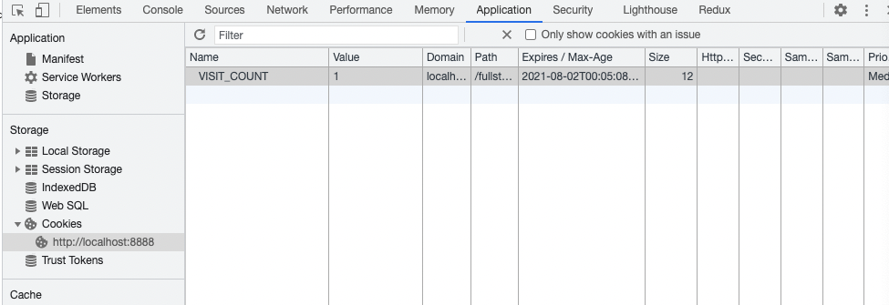

# Web

## Getメソッドの特徴
  - パラメータはURLの一部としてサーバーに送信される
    - Get /path?param1=値&param2=値
  - ブラウザキャッシュは有効
    - Apacheの設定による

## Postメソッドの特徴
  - パラメータはメッセージBodyに設定される
  - ブラウザキャッシュは無効

## HTTPとステートレス
  - HTTPはリクエストの前後で状態を保持しない（ステートレスな）プロトコルである
  - ステートフルなプロトコル
    - 例：FTP、SSHなど

# GETとPOSTの使い分け
  - URLは最大2000文字程度までしか設定できない
  - GETではパラメータを含めて共有できる

# リクエストをまたぐ値の保持の仕方
  - ブラウザに保存
    - Cookie
  - サーバーに保存
    - SESSION
    - データベース

## setcookie
  - クッキーを送信する
    - setcookie() は、その他のヘッダ情報と共に 送信するクッキーを定義します。 ほかのヘッダ情報と同様に、 クッキーは、スクリプトによる他のあらゆる出力よりも前に 送信される必要があります（これはHTTPプロトコルの制約です）。 <html> や <head> タグはもちろん 空白も含め、あらゆる出力よりも前にこの関数をコールするようにしなければなりません。

## expires
  - クッキーの期限を設定する

```
setcookie('VISIT_COUNT', 1, [
    'expires' => time() + 60 * 60 * 24 * 30
]);
```



## HttpOnly
  - true
    - javascriptからクッキー改竄できないようにする

## session_start
  - 新しいセッションを開始、あるいは既存のセッションを再開する
  - これを宣言しないとsessionを使用できない

## Session
  - ブラウザからサーバーにリクエストを送るとCookieにセッションIDをセット
    - Session_id: xxx
  - そしてサーバーからのレスポンスで受け取り、ブラウザにセッションIDを保持する

## phpinfo
  - PHP の設定情報を出力する

## die
  - 処理を終える
    - exit と同等
