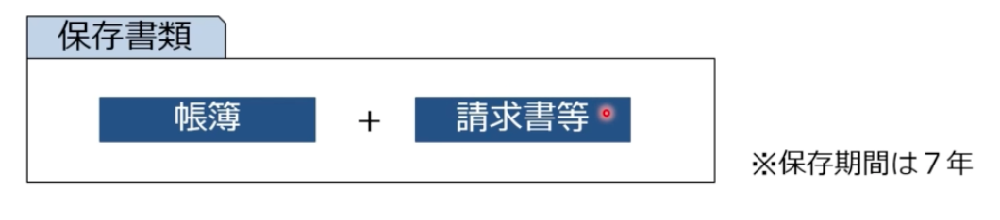
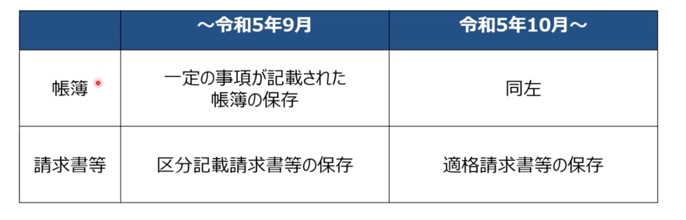

# 仕入税額控除

## 仕入税額控除とは
  - 仕入税額控除とは、納付する消費税額の算出にあたり、売上の消費税額から仕入の消費税額を差し引いて計算することをいう。
  - 預り消費税 - 支払消費税（支払税額控除） = 納税額
    - ※消費税における「仕入」とは、勘定科目としての「仕入」に限らない。
      - 機械や建物等の購入または賃借
      - 原材料や事務用品の購入
      - 運送費
      - 水道光熱費
      - 外注費など
    - 事業のために支払ったコストは全て対象
      - ※支払う相手が免税事業者でも個人でも同じ扱い

## 仕入税額控除の要件
  - 課税仕入等に関して所定の事項が記載された帳簿及び請求書等の両方を保存していないと、仕入税額控除が認められない
    - 請求書等 = 請求書、納品書、領収書、レシートその他取引の事実を証明する書類
    - ※保存期間は7年
  - 保存要件を満たしていないと、物品やサービスの代金にかかる消費税を支払ったとしても、預り消費税から差し引くことができない。
    - つまり、納付する消費税が大きくなってしまう
  - 

## 仕入税額控除の要件の変更点
  - 
