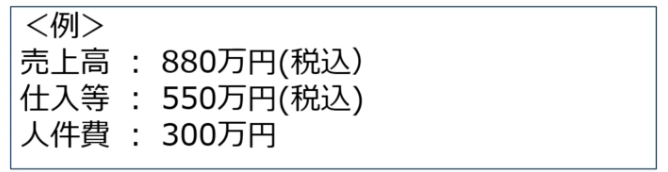
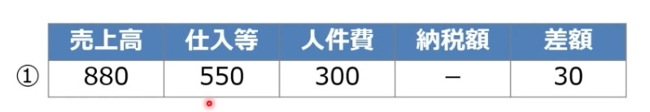
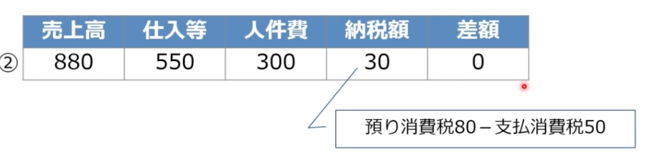

# 免税事業者の対応策

## ケーススタディ

### ケース１
  - 美容院を経営している免税事業者
  - 客層は、近所に住む個人のみ

### ケース2
  - 居酒屋を経営している免税事業者
  - 客層は個人客が多いが、定期的に近隣の会社から接待や宴会などの予約が入ることで、経営が成り立っている

### ケース３
  - フリーランスでシステムエンジニアをしている免税事業者
  - 大企業からのシステム開発の請負業務が売上の大半を占めている

## 免税事業者はどう対応すべきか？
  - 顧客が「一般消費者」と「事業者」、混在する場合は。顧客別売上の構成比率で影響を検討する

### 顧客が「一般消費者」
  - 適格請求書でなくてもお客さんは困らない
  - 消費税の申告をしないため
  - 免税事業者のままでOK

### 顧客が「事業者」
#### 本則課税の事業者
  - 適格請求書でないと仕入税額控除を受けられない
  - 課税事業者になる方が良い？

#### 簡易課税の事業者
  - 適格請求書でなくてもみなし仕入率によって仕入税額控除を受けられる
  - 免税事業者のままでOK

## 免税事業者がもっとも損しない方法は？
  - 「本則課税の法人」を相手に商売している免税事業者の選択肢
    1.  免税事業者のまま（売値もそのまま）
    2.  課税事業者になる（免税を放棄）
    3.  免税事業者のまま（消費税分値下げ）
     -  どれが一番得するか？（どれが一番損するか？）

  - 

 

### 1. 免税事業者のまま（売値もそのまま）
  - 
  - ただし、顧客を失うリスクが伴う
    - 差額30万円に法人税（所得税）は課される

### 2. 課税事業者になる
  - 
  - 簡易課税制度を使えば上記より少額になる場合も有る

### 3. 免税事業者のまま（消費税分値下げ）
