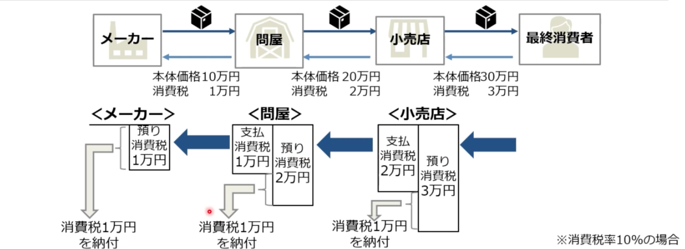
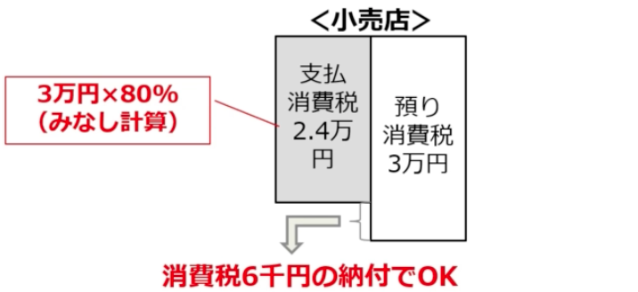
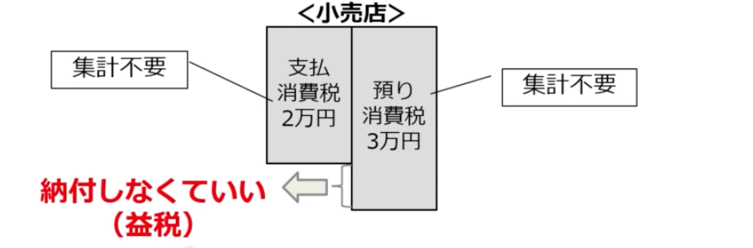
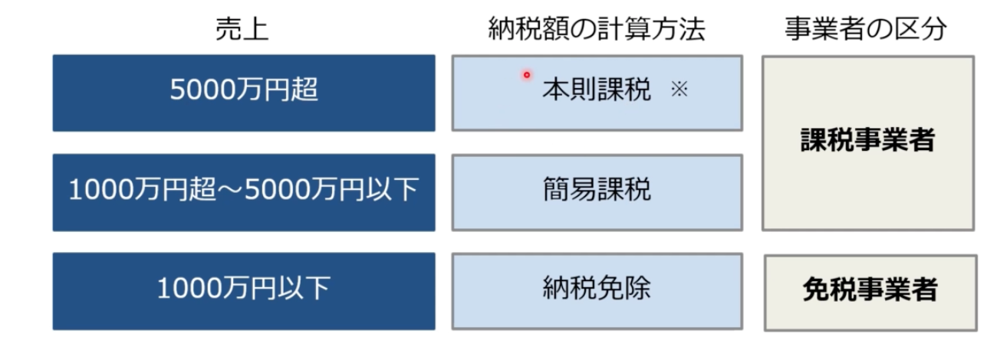

# 消費税制度の仕組み

## コースの対象者
  - インボイス制度のことをよく知らない方
  - 消費税の申告・納付をしていない個人事業主・零細企業
  - 今副業をしている方、これから副業をする予定の方
  - 免税事業者と取引している企業の経理担当者
    - 特にフリーランス
    - 個人タクシーの運転手
    - ウーバーイーツの配達員など

 ## 全体像
  - 消費税制度の仕組み
  - 仕入税額控除
  - 請求書の記載内容の変更点
  - 適格請求書発行事業者の登録制度
  - 免税の事業者の対応策
  - 課税事業者の対応策

## インボイス制度の概要
  - 適格請求書等保存方式とは？
    - 複数税率（8%と10%）に対応するために導入される仕入税額控除の方式（＝インボイス制度）
  - 導入時期は？
    - 令和5年10月1日
  - 適格請求書とは？
    - 「売り手が、買い手に対し正確な適用税率や消費税額等を伝えるための手段」であり、このことを「インボイス」という

## 消費税制度の仕組み
  - 消費税は、事業者の販売する物品やサービス等の価格に上乗せされ、消費者が負担する税金
  - しかし、消費者が直接国に納めるのではなく、事業者が消費者から預かった消費税を、消費者に代わって国に納める税金（間接税）
  - 
  - ただ全ての全ての事業者が引き算で計算するのではない
    - 簡易課税制度を採用している場合がある

## 簡易課税制度とは？
  - 支払消費税をみなし計算可能
  - 計算式
    - 預かり消費税 * みなし仕入率 = 支払消費税
    - みなし仕入率は、業種によって異なる
      - 卸売業：90%
      - 小売業：80%
      - 製造業：70%など
  - 

## 事業者免税点制度とは？
  - 預かり消費税も支払消費税どちらも集計不要
  - 事業者免税点制度は、小規模事業者の事務負担や税金負担への配慮から、一定の規模以下の事業者について消費税の申告・納付を免除する特例措置
    - 2年前の課税売上高が1,000万円以下の事業者のみが選択できる
  - 
    - 税務署に申請すれば、2年前の課税売上高が1,000万以下であっても課税事業者になることができる（免税の放棄）
    - 貿易関連でむしろ消費税申告して還付されることもある、らしい
  - 問題視されている…

## 消費税を巡る事業者の種類
  - 事業者の中には、課税事業者（本則課税、簡易課税）と免税事業者が存在する
    - 法人か個人事業主かは無関係
    - 本則課税は一般課税、原則課税とも言われる
  - 売上高で区別される
  - 
