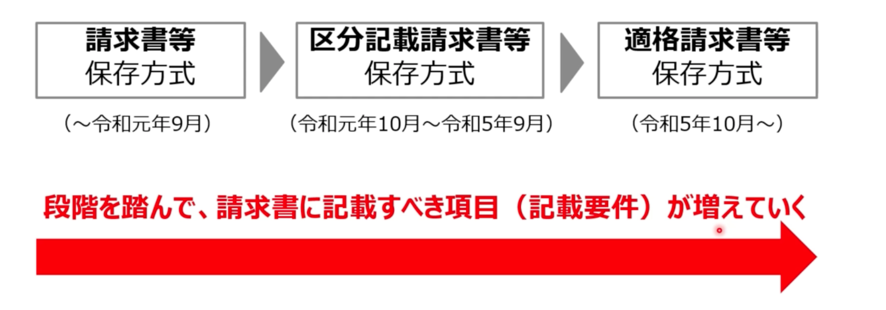
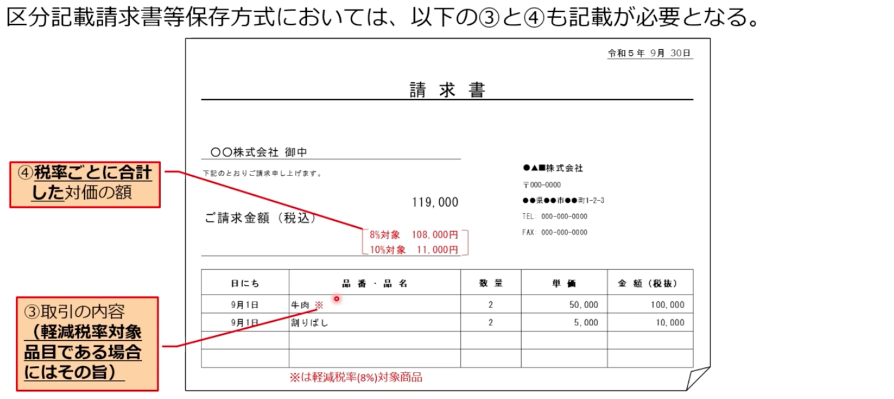
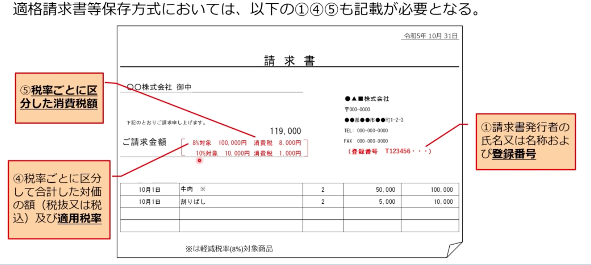

# 請求書の記載内容の変更点

## 請求書等の方式の違い
  - 令和5年10月1日から適格請求書等保存方式（インボイス制度）が開始される
  - 新制度の本格導入までの4年間は経過措置（区分記載請求書等保存方式）
  - 

## 区分記載請求書の記載要件
  - 「区分記載請求書等保存方式」では、軽減税率の対象科目である旨と、税率ごとに合計した対価の額を記載する必要がある。

### 区分記載請求書等保存方式（令和元.10.1 ~ 令和5.9.30）
  1. 請求書発行者の氏名又は名称
  2. 取引年月日
  3. 取引の内容（軽減税率対象科目である場合にはその旨）
  4. 税率ごとに合計した対価の額
  5. 請求書受領者の氏名または名称

  - 

## 適格請求書の記載要件
  - 「適格請求書等保存方式」では、「区分記載請求書等保存方式」での記載に加え、登録番号と適用税率ごとに区分した消費税額も記載する必要がある

### 適格請求書等保存方式
  1. 請求書発行者の氏名または名称及び登録番号
  2. 取引年月日
  3. 取引の内容（軽減税率対象品目である場合にはその旨）
  4. 税率ごとに区分して合計した対価の額（税抜または税込）及び適用税率
  5. 税率ごとに区分した消費税額等
  6. 請求書受領者の氏名または名称
  - 
