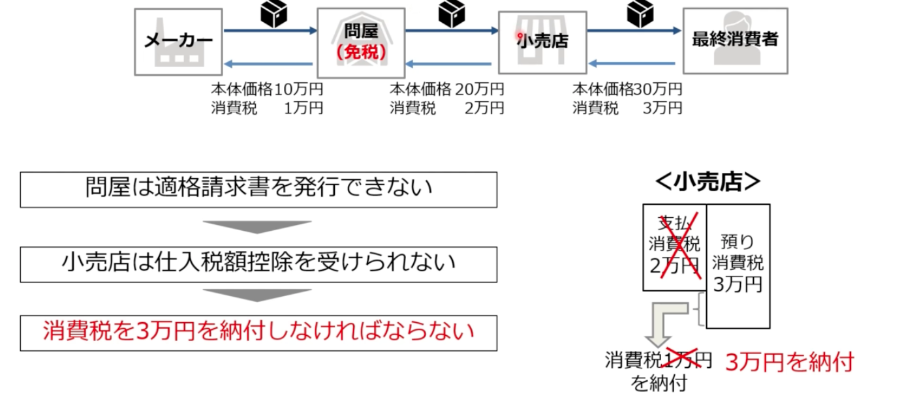
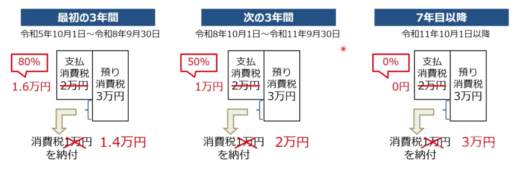

# 適格請求書発行事業者の登録制度

## 適格請求書発行事業者の登録制度とは
  1.  適格請求書発行事業者の登録によって、適格請求書が発行できるようになる
  <br> （登録手続きすると、「登録番号」が付与される）
  2.  「登録番号」が書かれた請求書（適格請求書）のみが仕入税額控除の対象
  3.  ただし、登録手続きは課税事業者しかできない（＝免税事業者は登録できない）
  <br>
```
 ＜留意点＞
  軽減税率対象品目の販売を行なっていない事業者であっても、登録を受けなければ、適格請求書を相手方に交付することはできない
  法人も個人事業主も同様
```
<br>

  - 適格請求書発行事業者の登録情報は国税庁のホームページにて公表される
    - 取引相手先が、適格請求書発行事業者（課税事業者）か否かは誰でもわかる

## インボイス制度開始後に起こること
  1. 仮に免税（登録事業者でない）場合は、免税店は適格請求書を発行できない
  2. 請求書を受け取った取引先は仕入税額控除を受けられない
  3. 支払消費税を支払っていないとみなされ、その分納税する義務が発生する

<br>

- 


## 課税事業者と免税事業者との対比
  - 結論： インボイス制度により、多くの個人事業主が廃業を迫られる恐れがある


### 課税事業者
  - 適格請求書を発行できる
  - 課税事業者からの仕入れは、仕入税額控除できる

### 免税事業者
  - 適格請求書を発行できない
  - 免税事業者からの仕入れは、仕入税額控除できない
  - 免税事業者とは取引したくない
    - 顧客を失う可能性
    - 免税を放棄
    - （消費税分）値下げする

## 免税事業者からの仕入れに関する経過措置
  - 免税事業者からの仕入れについてはその後3年間80%、さらにその後3年間は50%仕入税額控除ができるという経過措置がある。
  - 経過措置があっても事務手続きが煩雑になる
    - 免税事業者が避けられる可能性大
  - 
