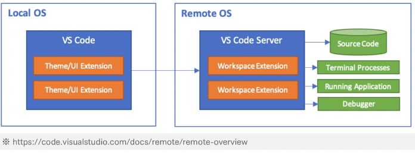
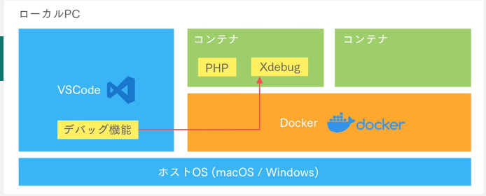
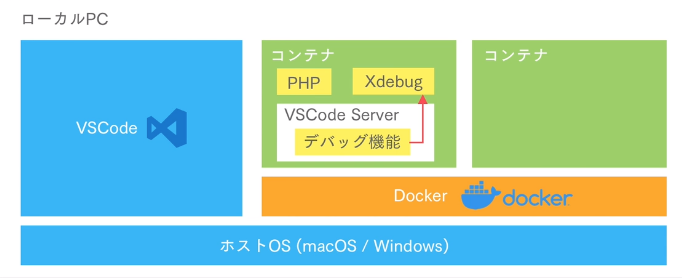
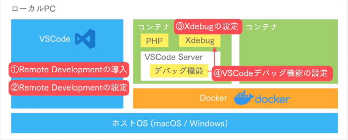

# デバッガ
  - デバッグ（バグの原因を見つける）作業を手伝ってくれる

## PHPの定番デバッガ「Xdebug」
  - XdebugはPHPのエクステンション。デバッグの機能を提供

### 特徴
  - コードにブレークポイントを設定して一行ずつアプリケーションを実行
  - ブレークポイントごとに変数の中身を出力して確認
  - エラーが発生するまでの経過を詳細に表示
  - VSCode（IDE）と一緒に使える

### VSCode × DockerでXdebugを使うには
  - VSCodeのRemote Developmentを使うと便利
    - VSCodeからコンテナやサーバーに接続し開発できる








## Xdebug設定



# 静的解析
  - 静的解析とはコードを実行せずにコードのチェックを行うこと

## メリット
  - バグ修正コストが下がる
  - コードの可読性、保守性が上がる
  - 良いレビューの書き方が習慣づけられる
  - レビューコストが下がる

## 注意点
  - 実行時の問題は検出しづらい
    - 挙動の確認
    - メモリリーク

## コードの可読性
  - コーディング規約にそって書かれているかを確認
  - ツール
    - PHP_CodeSniffer

## バグの発生
  - エラーがないかを確認
  - ツール
    - PHPStan

## コードの複雑さ
  - 複雑なコードを書いていないかを確認
  - ツール
    - PHPMD

## PHP_CodeSniffer
  - コーディング規約に則ってコードを書けているかを静的解析するツール
  - [php_codesniffer](https://github.com/squizlabs/PHP_CodeSniffer)

### phpcs
  - コーディング規約を守れてないコードの検出
  - [PSR-12](8https://www.php-fig.org/psr/psr-12/)

### phpcbf
  - コーディング規約にしたがってコードを自動修正

# 実操作ログ

※デバッグは切っておく必要あり

./vendor/bin/phpcs --standard=PSR12 sample.php

code1
```
<?php

const price = 100;

```

出力結果
```
FILE: /var/www/html/sample.php
-------------------------------------------------------------------------------
FOUND 1 ERROR AFFECTING 1 LINE
-------------------------------------------------------------------------------
 3 | ERROR | Class constants must be uppercase; expected PRICE but found price
-------------------------------------------------------------------------------
```
### Printing a List of Installed Coding Standards
    - PHP_CodeSnifferは、インストールされているコーディング標準のリストを出力できるため、テストに使用するコーディング標準を正しく指定できます。このリストは、-iコマンドライン引数を指定することで印刷できます。


./vendor/bin/phpcs --standard=PSR12 -i

```
[19-Jun-2021 17:17:24 Asia/Tokyo] Xdebug: [Step Debug] Could not connect to debugging client. Tried: localhost:9003 (through xdebug.client_host/xdebug.client_port) :-(
The installed coding standards are MySource, PEAR, PSR1, PSR12, PSR2, Squiz and Zend
```

### 適用したくないルールを除外する

例
```
<rule ref="PSR12">
    <exclude name="Generic.NamingConventions.UpperCaseConstantName.ClassConstantNotUpperCase"/>
  </rule>
```

### コマンドをcomposerに登録

composer.jsonに「./vendor/bin/phpcs --standard=phpcs.xml」を登録

```
 "scripts": {
        "phpcs":"./vendor/bin/phpcs --standard=phpcs.xml"
    }
```

そうすると実行コマンドが以下のようになる

```
composer phpcs
```

## PHPMD
  - コードの問題点を確認する

### 役割
  - バグの検知
  - 汚いコードの検知
  - 複雑なコードの検知
  - 使用していない引数や関数の検知

###　インストール

  - [phpmdインストール](https://phpmd.org/download/index.html)

composer.jsonのrequire-devに以下のように記載し、composer updateコマンドを叩く（//コメント文は削除）

```
 "require-dev": {
        "squizlabs/php_codesniffer": "3.*",
        //phpmd
        "phpmd/phpmd" : "@stable"
    },
```

### コマンドをcomposerに登録

composer.jsonに「./vendor/bin/phpmd . text phpmd.xml --suffixes php --exclude vendor」を登録

```
 "scripts": {
        "phpmd":"./vendor/bin/phpmd . text phpmd.xml --suffixes php --exclude vendor"
    }
```

そうすると実行コマンドが以下のようになる

```
composer phpmd
```

## PHPStan
  - バグチェック

### 検出
  - 未定義の変数
  - 関数に渡す引数の数
  - 型の不備


### インストール

コマンド
```
composer require --dev phpstan/phpstan
```

composer.json
```
"require-dev": {
        "squizlabs/php_codesniffer": "3.*",
        "phpmd/phpmd" : "@stable",
        "phpstan/phpstan": "^0.12.90"
    },
```

エラーチェック(sample.php)
```
<?php

function sayHello($argString)
{
    echo "Hello" . $argString . PHP_EOL;
}

//引数なしというエラーを想定
sayHello();

```

コマンド実行

```
vendor/bin/phpstan analyse sample.php
```

結果
```
1/1 [▓▓▓▓▓▓▓▓▓▓▓▓▓▓▓▓▓▓▓▓▓▓▓▓▓▓▓▓] 100%

 ------ ----------------------------------------------------------
  Line   sample.php
 ------ ----------------------------------------------------------
  8      Function sayHello invoked with 0 parameters, 1 required.
 ------ ----------------------------------------------------------


 [ERROR] Found 1 error
```

### NEONフォーマットの構成

phpstan.neon
```
parameters:
  level: 6
  paths:
   - .
  excludePaths:
   - vendor

```

実行コマンド
```
./vendor/bin/phpstan analyse -c phpstan.neon
```

結果

```
1/1 [▓▓▓▓▓▓▓▓▓▓▓▓▓▓▓▓▓▓▓▓▓▓▓▓▓▓▓▓] 100%

 ------ --------------------------------------------------------------------------
  Line   sample.php
 ------ --------------------------------------------------------------------------
  3      Function sayHello() has no return typehint specified.
  3      Function sayHello() has parameter $argString with no typehint specified.
  8      Function sayHello invoked with 0 parameters, 1 required.
 ------ --------------------------------------------------------------------------


 [ERROR] Found 3 errors
```

/** @phpstan-ignore-next-line */を追加すると、エラーを除外できる

```
/** @phpstan-ignore-next-line */
function sayHello($argString)
{
    echo "Hello" . $argString . PHP_EOL;
}

sayHello();
```

出力結果
```
1/1 [▓▓▓▓▓▓▓▓▓▓▓▓▓▓▓▓▓▓▓▓▓▓▓▓▓▓▓▓] 100%

 ------ ----------------------------------------------------------
  Line   sample.php
 ------ ----------------------------------------------------------
  9      Function sayHello invoked with 0 parameters, 1 required.
 ------ ----------------------------------------------------------


 [ERROR] Found 1 error
```


# 自動テスト
  - テストを自動化することで動作確認の手間暇を減らすことができる

## メリット
  - 動作確認の目検チェックを毎回行わずにすむ（自動化できる）
  - 安心してリファクタリングできるようになる

## PHPUnit
  - PHPの単体テストむけのフレームワーク
    - 単体テスト：クラス、関数などプログラムを構成する小さな単位で個々の動作を確認するためのテスト
  - クラス、関数単位で動作を確認でき、コマンドで簡単に実行できる
